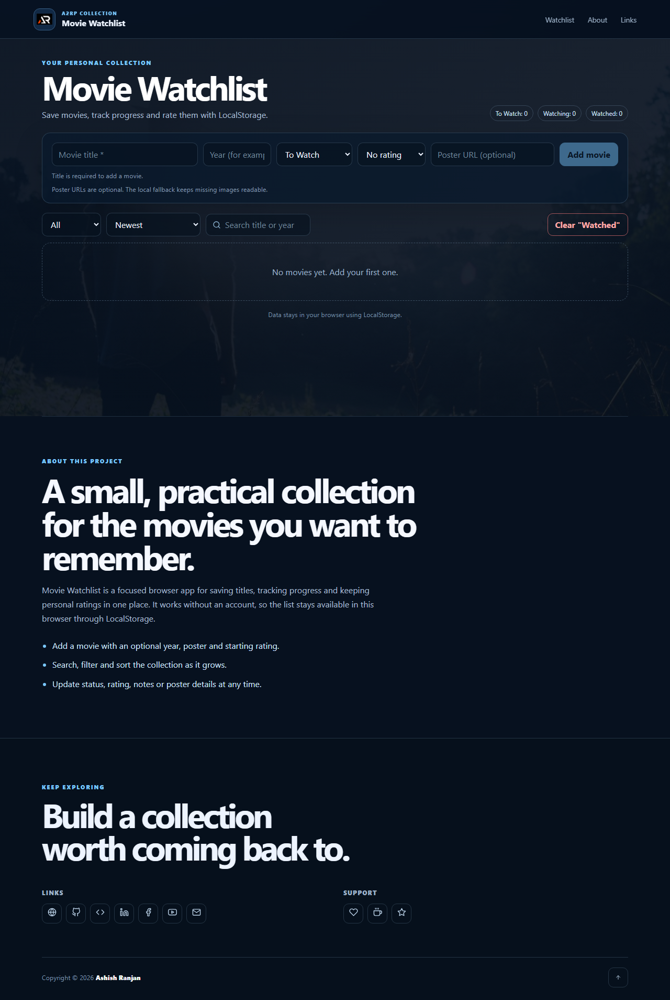

# Movie Watchlist

A responsive React watchlist for saving movies, tracking viewing progress and keeping personal ratings in the browser.



## Features

- Add movies with year, poster URL, status and rating
- Search, filter and sort the collection
- Edit notes and movie details
- Quick status and rating controls
- LocalStorage CRUD with no account required
- Responsive layout with mobile navigation

## Tech stack

React, Vite, styled-components, React Icons and browser LocalStorage.

## Run locally

```bash
npm install
npm run dev
```

## Deploy

```bash
npm run deploy
```

Live site: [Movie Watchlist](https://a2rp.github.io/movie-watch-list/)

## Links

- Portfolio: [https://www.ashishranjan.net/](https://www.ashishranjan.net/)
- GitHub: [https://github.com/a2rp](https://github.com/a2rp)
- CodePen: [https://codepen.io/ash1198](https://codepen.io/ash1198)
- LinkedIn: [https://www.linkedin.com/in/aashishranjan](https://www.linkedin.com/in/aashishranjan)
- Facebook: [https://www.facebook.com/theash.ashish/](https://www.facebook.com/theash.ashish/)
- YouTube: [https://www.youtube.com/@ashishranjan-ashz?sub_confirmation=1](https://www.youtube.com/@ashishranjan-ashz?sub_confirmation=1)
- Email: [mailto:ash.ranjan09@gmail.com](mailto:ash.ranjan09@gmail.com)

## Support

- Support: [https://a2rp-donation-page.netlify.app/](https://a2rp-donation-page.netlify.app/)
- Buy Me a Coffee: [https://buymeacoffee.com/a2rp](https://buymeacoffee.com/a2rp)
- Patreon: [https://patreon.com/a2rp](https://patreon.com/a2rp)